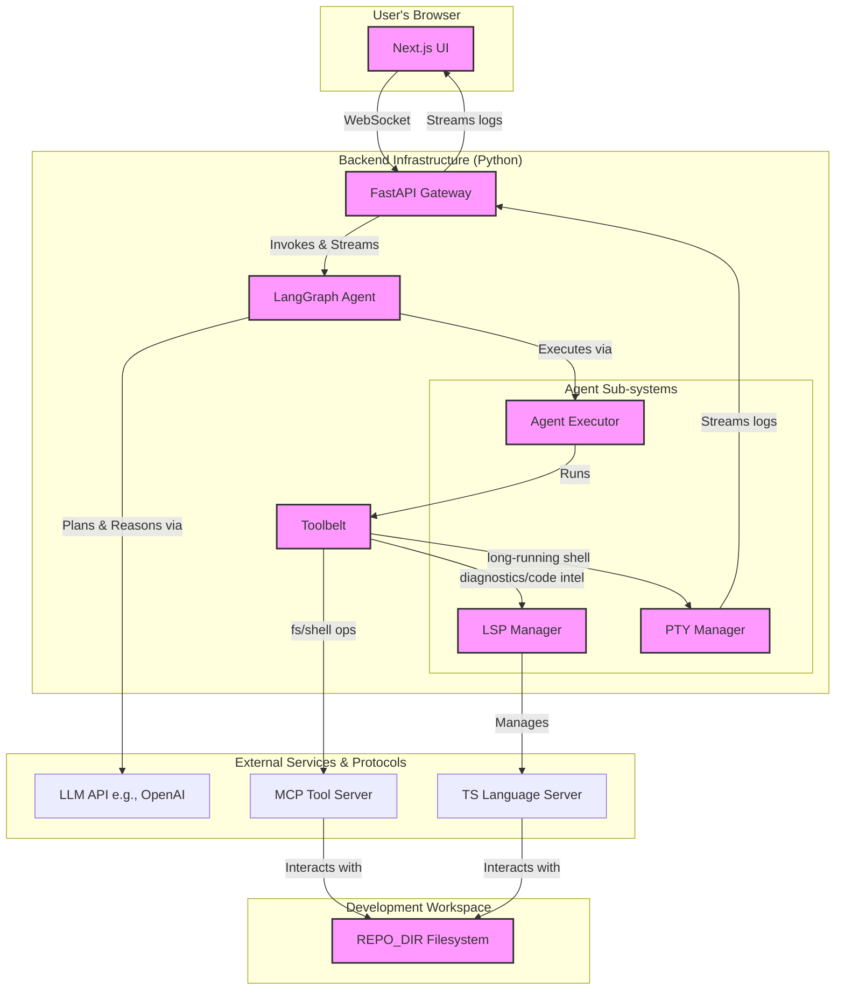

# System Architecture

**Version:** 2.0
**Date:** July 17, 2024

## 1. Overview

This document outlines the architecture of the LLM-powered AI Agent, a system designed to convert natural language prompts into fully functional Next.js web applications. The system is architected as a modular, tool-using AI agent that interprets user requests, plans and executes development tasks, and iteratively refines the generated application through a conversational interface.

The core principles guiding this architecture are:

*   **Agent-Centric Design:** A central planner LLM orchestrates the entire workflow, deciding which tools to use and when, rather than following a rigid, predefined graph.
*   **Modularity:** Each component (Gateway, Agent, Tools, LSP/PTY Managers) has a well-defined responsibility, enabling independent development, testing, and enhancement.
*   **Asynchronous & Stream-First:** The system is built with `asyncio` from the ground up. The FastAPI Gateway uses WebSockets to stream events—from LLM thoughts to PTY logs—in real-time to the UI, providing immediate user feedback.
*   **Robust Tooling:** The agent's capabilities are defined by a "Toolbelt" of functions that interact with the development environment through stable protocols like MCP (for shell/file ops) and LSP (for code intelligence).

---

## 2. Architectural Diagram

---

## 3. Core Components

### 3.1. Frontend (`ui/`)

*   **Technology:** Next.js, TypeScript, React, Tailwind CSS.
*   **Responsibilities:**
    *   Provides the primary user interface, featuring a `ChatInterface` for prompts and a `MainPanel` for tabbed content.
    *   Manages a single, persistent WebSocket connection to the `FastAPI Gateway`.
    *   Receives and renders a real-time stream of events from the agent, including LLM tokens, tool calls, and PTY logs, using a defined message schema (`ui/src/types/ws_messages.ts`).
    *   Features a `TerminalView` to display live output from long-running scaffolding and build commands.
    *   (Future) Will host a live preview of the generated application.

### 3.2. FastAPI Gateway (`gateway/`)

*   **Technology:** FastAPI, Uvicorn, WebSockets.
*   **Responsibilities:**
    *   Acts as the primary entry point and communication hub between the frontend and the agent.
    *   Manages the lifecycle of the application, including initializing the `REPO_DIR` workspace on startup.
    *   Handles the `/api/agent` WebSocket endpoint, accepting user prompts and streaming all agent events back to the UI.
    *   Receives PTY (pseudo-terminal) events from the `PTYManager` and relays them directly to the UI over the WebSocket.
    *   Invokes the LangGraph agent using `astream_events` to get a full, granular stream of the agent's execution trace.

### 3.3. LangGraph Agent (`agent/`)

*   **Technology:** LangGraph, LangChain.
*   **Responsibilities:**
    *   The "brain" of the system, defined in `agent/agent_graph.py`. It orchestrates the entire task execution flow.
    *   Maintains the conversational and operational state in a `TypedDict` (`agent/state.py`).
    *   Implements a **two-step planner** pattern:
        1.  **Reasoning Step (`planner_reason_step`):** A lightweight LLM call to decide *which* tool to use next, or to finish.
        2.  **Argument Generation Step (`planner_arg_step`):** A second, focused LLM call to generate the JSON arguments for the chosen tool.
    *   Uses conditional edges (`should_scaffold`, `after_reasoner_router`) to dynamically alter its path based on the current state.
    *   The agent is designed to be stateless in its nodes; all state is managed explicitly in the `AgentState`.

### 3.4. Agent Executor (`agent/executor/`)

This submodule is responsible for the robust execution of tool calls identified by the planner. It decouples the agent's graph logic from the mechanics of tool invocation.

*   **`runner.py`:** Contains `run_single_tool`, the core function for invoking a tool. It handles argument injection (e.g., `project_subdirectory`), PTY task handling, and structured error catching.
*   **`output_handlers.py`:** Implements a registry-based system (`OUTPUT_HANDLERS`) for determining the success of a tool call (`is_tool_successful`) and formatting its output into a string (`format_tool_output`) suitable for the LLM.
*   **`parser.py`:** Provides utilities to safely parse `ToolCall` objects from the LLM's AIMessage.
*   **`fix_cycle.py`:** Defines the `FixCycleTracker` for managing the state of self-healing loops (e.g., tracking how many times a fix has been attempted for a failing tool).

### 3.5. Toolbelt (`tools/`)

This is a collection of Python functions decorated with `@tool` that the agent can invoke. They are the agent's interface to the outside world.

*   **`shell_mcp_tools.py`:** Executes shell commands via the MCP server. Includes a `pty: bool` flag to delegate long-running commands to the `PTYManager`.
*   **`file_io_mcp_tools.py`:** Reads and writes files via the MCP server.
*   **`patch_tools.py`:** Applies `diff` patches using `git apply` for precise code modifications.
*   **`diagnostics_tools.py`:** Fetches diagnostics (errors, warnings) from the LSP Manager.
*   **`lsp_tools.py`:** Performs code-intelligent actions like go-to-definition and hover.
*   **`vector_store_tools.py`:** Performs semantic search over the codebase.

### 3.6. Sub-system Managers

These are singleton-style managers that handle persistent, stateful resources like server processes.

*   **`agent/lsp_manager.py`:** Manages the lifecycle of Language Server Protocol instances (e.g., `typescript-language-server`). It maintains a registry of LSP clients keyed by workspace path, provides an async interface for tools, and caches diagnostics. It can also restart the LSP server when `tsconfig.json` changes.
*   **`agent/pty/manager.py`:** Manages pseudo-terminal processes for long-running, interactive shell commands. It spawns processes, streams their `stdout`/`stderr` via callbacks, and ensures they are properly terminated on exit.

---

## 4. Data Flow & Communication

A typical user interaction follows this sequence:

1.  **Prompt:** The user sends a prompt (e.g., "Create a new Next.js app") from the **UI**.
2.  **WebSocket Message:** The UI sends a JSON message to the **FastAPI Gateway**.
3.  **Agent Invocation:** The Gateway initiates an agent run by calling `agent_graph.astream_events` with the user's prompt, passing in PTY callbacks into the initial `AgentState`.
4.  **Reasoning:** The **Agent**'s `planner_reason_step` calls the **LLM API**, determines `shell.run` is the best tool, and updates the state.
5.  **Argument Generation:** The `planner_arg_step` calls the **LLM API** again to generate the `npx create-next-app...` command arguments for the `shell.run` tool.
6.  **Execution (PTY Flow):**
    a. The `tool_executor_step` calls `run_single_tool` in the **Agent Executor**.
    b. `run_shell` sees `pty=True` and calls the **PTY Manager** to spawn the command.
    c. The `PTYManager` emits `task_started`, `task_log`, and `task_finished` events via the callbacks provided by the Gateway.
    d. The **Gateway** relays these PTY events directly to the **UI**, which displays them in the `TerminalView`.
    e. The agent's graph execution *pauses* until the PTY task is complete.
7.  **Result & Continuation:** Once the PTY task finishes, the agent's graph unblocks. The tool result (a simple success message) is added to the state. The agent loops back to the **Reasoning** step, sees the successful scaffolding, and plans its next action (e.g., `ls -R` to inspect files).
8.  **Final Response:** When the agent's plan is complete, it generates a final summary message, which is streamed to the UI as the last event.

---

## 5. Key Architectural Patterns

*   **Decoupled Tooling via MCP:** Tools for file system and shell access do not directly perform I/O. Instead, they are clients to the **MCP Tool Server**, which runs as a separate process. This aligns with modern agentic architectures (Figma, VS Code) and allows the tool server to be secured and managed independently.
*   **Stateful Managers for Processes:** The `LspManager` and `PTYManager` encapsulate the complexity of managing external, long-running processes, providing clean, async interfaces to the rest of the application and ensuring proper resource cleanup.
*   **Declarative Self-Healing:** The agent doesn't have a hardcoded "fix error" state. Instead, when a tool like `run_shell` or `get_diagnostics` returns an error, that error is simply added to the agent's state as a `ToolMessage`. The main planner LLM sees the error in its context and decides on the next step, which could be reading the problematic file, applying a patch, or asking the user for clarification.
*   **Configuration as Code:** All application settings, from API keys to server URLs and file paths, are managed centrally in `common/config.py` using Pydantic's `BaseSettings`, which loads from both environment variables and `.env` files.

---

## 6. Document Maintenance

This architecture document is a living document. It must be updated whenever significant changes are made to the core components, their responsibilities, or the communication flow between them.