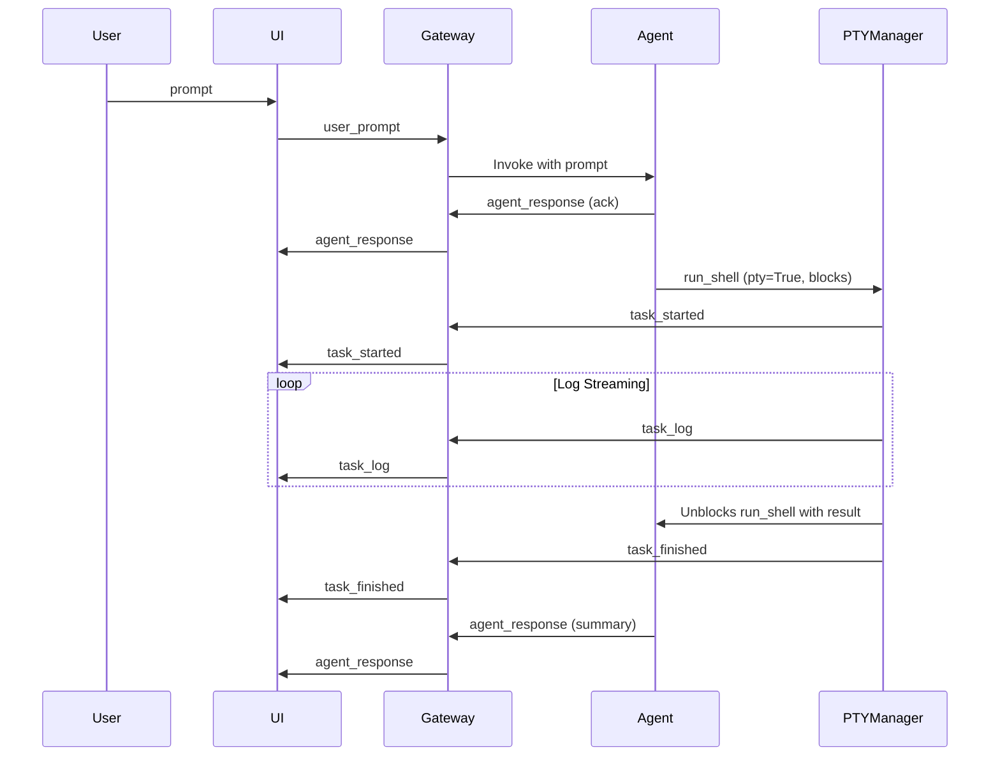

# User Flow — Prompt‑to‑App Generation Chat

*Defines the **frontend–agent interaction** from a user‑experience perspective. Complements the “PTY‑Streaming Design V2” back‑end spec.*

---

## 1 Goal

Give end‑users a **single conversational interface** that:

1.  Accepts a natural‑language prompt to scaffold a new web app.
2.  Streams real‑time progress (acknowledgements, build logs, final results).
3.  Supports iterative back‑and‑forth edits, mirroring workflows in Lovable, Bolt, Replit, V0, etc.

---

## 2 Actors

| Actor | Role |
| :--- | :--- |
| **User** | Non‑technical person describing desired app behaviour. |
| **UI (ChatInterface.tsx)** | Renders chat bubbles, progress logs, and live preview. |
| **Gateway (FastAPI WS)** | Message relay between UI and Agent Runtime. |
| **Agent Runtime** | LLM‑driven planner/executor running scaffold & edits. |
| **PTYManager** | Streams long‑running command logs (see separate design). |

---

## 3 Primary flow

| # | Step | Event / Message | UI Behaviour |
| :--- | :--- | :--- | :--- |
| 1 | **Prompt** – user types “Build a recipe‑sharing Next.js app with login & image uploads.” | `user_prompt` | Chat bubble (right) shows the prompt. “Typing…” indicator appears for agent. |
| 2 | **Agent Ack** – Planner returns: “Sure! I’ll start scaffolding your recipe‑sharing app.” | `agent_response` | Bubble (left) displays text. |
| 3 | **Start task** – Executor calls `run_shell(..., pty=True)`. The tool call blocks internally while the PTY runs. | `task_started` payload `{taskId}` | A concise message appears in chat (`> Starting task...`). The UI switches the main content panel to the **Terminal** tab. |
| 4 | **Stream logs** – PTYManager emits chunks via the Gateway. | `task_log` | Logs append in real time within the **Terminal** tab. The view auto-scrolls. |
| 5 | **Task finished** – PTYManager signals completion. The agent's `run_shell` tool call unblocks and returns the result. | `task_finished` | Progress bar turns green (success) or red (error). |
| 6 | **Agent summary** – Agent processes the tool result and plans its next step: “Scaffold complete! Here’s a live preview.” | `agent_response` | A new agent message appears in chat. The UI switches the main content panel to the **Live App Preview** tab and refreshes it. |
| 7 | **Iterate** – User: “Change theme to dark mode.” | Repeat 1‑6 for incremental edits (smaller tasks). | |

---

### Sequence diagram (simplified)

---

## 4 UX requirements

1.  **Unified chat thread** – All high-level system, agent, and task *notifications* appear chronologically in the chat. Verbose output like logs appears in a dedicated panel.
2.  **Non‑blocking typing** – User can continue typing new messages while logs stream.
3.  **Auto‑scroll opt‑out** – Pause auto‑scroll when user hovers over logs.
4.  **Visual status cues** – Progress bar or spinner per task; colour‑coded on completion.
5.  **Error surfacing** – If `task_finished.state == error`, highlight log pane and show summary error bubble.
6.  **Content Panel** – A tabbed view renders either the live app preview or the terminal logs. The preview auto-refreshes after a successful scaffold or edit.
7.  **Accessibility** – Live‑region ARIA updates for screen readers; keyboard shortcuts for sending prompt (`Cmd+Enter`).

---

## 5 WebSocket contract additions

| Type | Payload fields | Notes |
| :--- | :--- | :--- |
| `user_prompt` | `prompt: str` | Sent from UI → Gateway. Standardized from `text`. |
| `agent_response` | `d: str` | Existing message type for agent's conversational responses. |
| `task_started` | `d: {taskId: str, name: str, startedAt: str}` | Correlates with subsequent log events. |
| `task_log` | `d: {taskId: str, chunk: str}` | Raw UTF‑8 bytes, up to 4 KB/frame. |
| `task_finished` | `d: {taskId: str, state: str, exitCode: int, durationMs: int}` | Triggers preview refresh on success. |

---

## 6 Edge cases & error handling

*   **Scaffold fails** → Agent receives the failed `RunShellOutput` and suggests a retry/fix, keeping the log pane open for inspection.
*   **Lost WebSocket** → UI tries to reconnect; on success requests missed events via `taskId`.
*   **Parallel requests** – If user submits a new prompt while a task is running, planner queues it or declines with polite message (TBD policy).

---

## 7 Open questions

1.  Should we debounce token‑level streaming to reduce WS chatter?
2.  How do we version the WebSocket API (header vs payload field)?
3.  Persist chat & log history per workspace or discard after session?